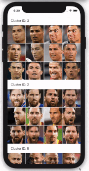
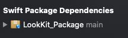

# LookKit SDK Face Grouping Demo

# Introduction
This LookKit Face Grouping Demo is design for you to gain a basic understanding of the LookKit Mobile SDK. 
It will implement the Face Clustering functionality.

# Requirements
- iOS 13.0+
- Xcode 12.0+
- Swift 5.3+

# SDK Installation with Swift Package Manager
Since this project has been integrated with LookKit SDK SPM now, please check the following steps to install LookKitSDK.framework using SPM after you downloading this project:

1. Install SPM

Make sure you have the LookKit_Package in you project tree.

2. Update the package

Go to File -> Swift Package -> Update to Latest Package Versions

3. Make sure you have enough photos with people on your traget (Simulator/iDevice).

# Feedback

We’d love to hear your feedback for this demo.

When you meet any problems of using this demo. At a minimum please let us know:

- Which iOS Device and iOS version you are using?
- A short description of your problem includes debug logs or screenshots.
- Any bugs or typos you come across.

# Contact us

You can always reach us at lalabsproducts@gmail.com

# License

LookKit SDK Face Grouping Demo is available under the MIT license. Please see the LICENSE file for more info.
