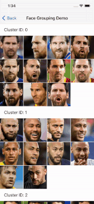
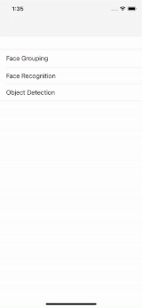
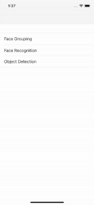

  

# DeepLook SDK Demo

# Introduction
This DeepLook Demo is design for you to gain a basic understanding of the DeepLook Mobile SDK. 
The sample App shows scenarios such as Object Detection, Face Verification, and Face Grouping.

# Requirements
- iOS 13.0+
- Xcode 12.0+
- Swift 5.3+

# Feedback

We’d love to hear your feedback for this demo.

When you meet any problems of using this demo. At a minimum please let us know:

- Which iOS Device and iOS version you are using?
- A short description of your problem includes debug logs or screenshots.
- Any bugs or typos you come across.

# Contact us

You can always reach us at lalabsproducts@gmail.com

# License

DeepLook SDK Demo is available under the MIT license. Please see the LICENSE file for more info.
